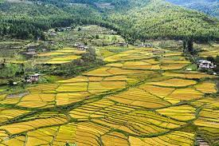
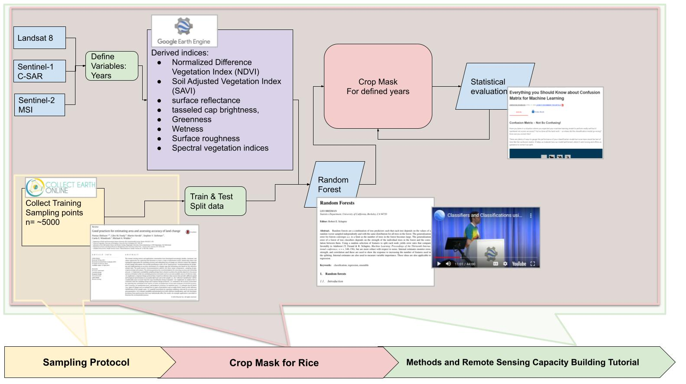

# DEVELOP_Bhutan_AG_I

--
1. Main Folder = [DEVELOP_Bhutan_Fall 2021](https://drive.google.com/drive/folders/19zDLUAnEqCeM5EiNtgeflMZl384gb5u4?usp=sharing)
2. Sub Folder = [Literature](https://drive.google.com/drive/folders/1rcV_GGOssyaRXC4p2CpsyhrKW0G7Ii53?usp=sharing)
3. Sub Folder Science Advising Meeting Document (SAM) = [Bhutan_AG_1_SAM_Slides](https://docs.google.com/presentation/d/1hQzjjbrgkgLyl-59oeFSNuKpfL4fpwf7cT6zPbCRzgA/edit#slide=id.p)
4. Workflow = [Bhutan_AG_I_Intial_Workflow](https://docs.google.com/drawings/d/1vK6Ax1fo_KXB9foDo-d1gectl2OzfUO_QOFl46__cO8/edit?usp=sharing)
5. GEE Repo for the project = [DEVELOP_BHUTAN_AG_I](https://code.earthengine.google.com/?accept_repo=users/tjm0042/DEVELOP_BHUTAN_AG_I)
6. GEE Assest Space set-up = [GEE Asset Space SCO Setup Guide](https://docs.google.com/document/d/1ZwBueyU2gPzakb3a9cdOUFp4DKnMJV9PzYi3JYAUEn0/edit)
7. Skype Channel (Main area to talk with Science Advisors) = [Bhutan_AG_I](https://join.skype.com/hTK6EQEIaFDz)
8. Collect Earth Online (CEO) Content = [Data Collection Manual](https://collect.earth/downloads/CEO_Manual_DataCollector_EN_20210331.pdf)
9. CEO Video = [Collect Earth - land monitoring through visual interpretation](https://youtu.be/3cxyFXt15aM)
10. Random Forest methods = [r-tools](https://github.com/dcarver1/r_tools-)

##
#add more files/content here 
